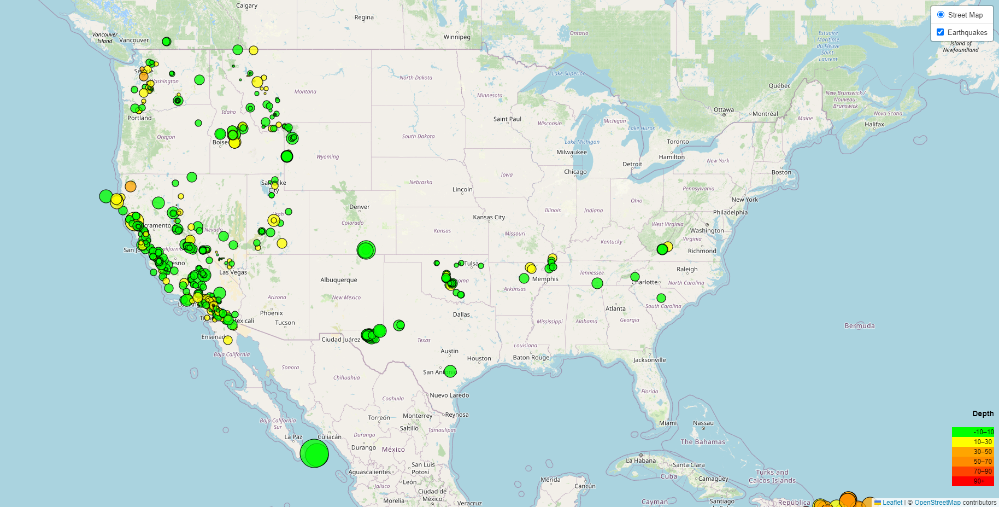

# Leaflet Challenge - Create an Earthquake Visualization

## Overview
### The United States Geological Survey, or USGS, provides and maintains data on the world's earthquakes. In this challenge, we aimed to develop a way of displaying this information in an accessible and visually appealing manner.

## Solution
### We created the above interactive map to better display the earthquake data shared by the USGS. This visualization:
- Plots all earthquakes recorded by the USGS in the last 7 days based on their longitude and latitude.
- Reflects the magnitude of the earthquake by the size of the marker.
- Reflects the depth of the earthquake by the color of the marker.
- Includes popups to provide the location, magnitude, depth, and time of each earthquake.
- Includes a legend to depict what depth each color marker represents.